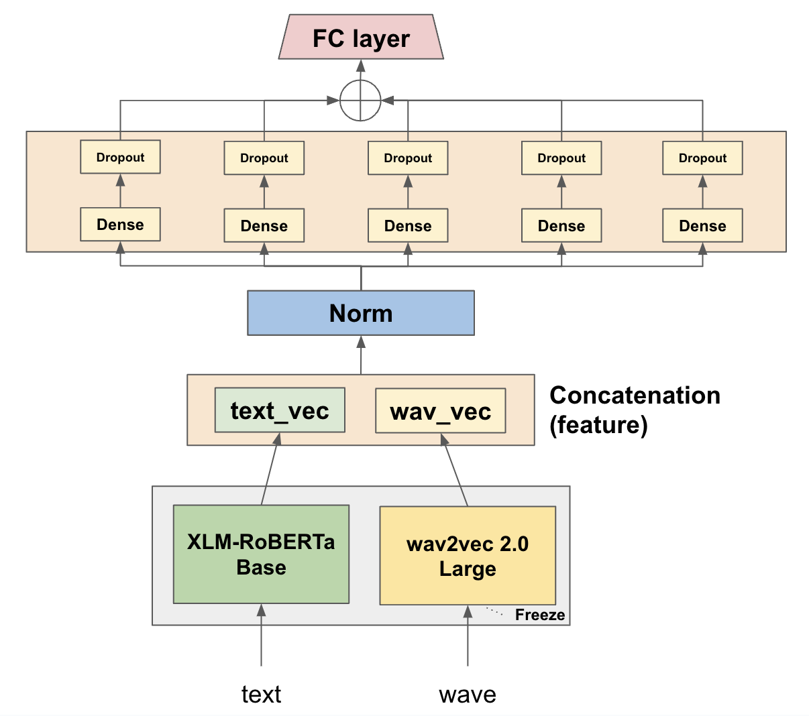

# Residual Self-Attention Cross Fusion Network (RSA-CFN)
## Introduction
This repository contains the code for the paper [Residual Self-Attention Cross Fusion Network] submitted to [2023 HumanUnderstanding AI Paper Competition](https://aifactory.space/competition/detail/2234)

> Autors: [@hyeonho1028](https://github.com/hyeonho1028),[@zerojin91](https://github.com/zerojin91), [@aibjw](https://github.com/aibjw)

## Environment
Python 3.9.X

We use conda to manage the environment. You can create the environment by running the following command:
```
conda env create -f environment.yaml
conda activate rsa_cfn
```

## Structure
To run the code, you need to download the dataset from [here](https://aifactory.space/competition/data/2234) and put it in the `data` folder as `KEMDy20_v1_1/`.

The folder structure should be like this:
```
├── data                    # Data folder
│   └── KEMDy20_v1_1          # <-- Put the datafiles here
├── img                     # Images folder
│   ├── arch/..               # Model Arch. Structure
│   └── Self-Attention..      # Others Images
├── src                     # Source code
│   ├── data.py               # to load data
│   ├── layer.py              # attention layer and cross fusion layer
│   ├── loader.py             # data loader
│   ├── models.py             # model architecture
│   └── trainer.py            # trainer for training and validation
├── script                  # Script folder
│   └── exp_shell.sh          # Shell script for Experiment
├── requirements.yaml       # Environment setting
├── main.py                 # Main script to run the code
└── README.md               # Description of the project
```

## Script 
```bash
python main.py --argument1 value1 --argument2 value2 ...
```
To run `main.py` script, you need to specify the following arguments:

### Base Setting
| <div style="width:120px">Argument </div> | Description | Default |
|:---|:---|:---|
| --data_path | Path to data directory | 'data/KEMDy20\_v1\_1/' |
| --output_dir | Path to output directory | 'models/' |
| --ver | Version name to logging | 'baseline' |
|--audio\_max\_lens | Number of Audio max lengths |96000|
|--text\_max\_lens | Number of Text max lengths | 256 |
| --num_classes | Number of classes | 7 |
|--seed | Random seed | 42 |

### Device Setting
| <div style="width:120px">Argument </div> | Description | Default |
|:---|:---|:---|
| --device | Device type `{cuda,cpu,mps}`| 'cuda' |
| --use_amp | Use Automatic Mixed Precision for training | True | 

### Label Transform
| <div style="width:180px">Argument </div> | Description | Default |
|:---|:---|:---|
| --label_transform | Perform label transformation | False | 
| --batch_weighted_sampler | Use batch weighted sampler for training | False | 

### Training Setting
| <div style="width:150px">Argument </div> | Description | Default | 
|:---|:---|:---|
| --batch_size | Batch size for training | 16 |
| --val_batch_size | Batch size for validation | 32 |
| --lr | Learning rate | 1e-5 *| 
| --epochs | Number of epochs for training | 10 |
| --weight_decay | Weight decay | 0.0 |

\* In wav2vec 2.0, the learning rate is set to 1e-4.

### Training mode
|<div style="width:150px">Argument </div> | Description | Default | 
|:---|:---|:---|
| --use_wav | Use wav2vec feature for training | False | 
| --use_concat | Concatenate modalities for training | False | 
| --multimodal_method | Multimodal method for training `{early_fusion,late_fusion,mlp_mixer,stack,residual,rsa,rsa_cfn,hybrid_fusion}` | 'early_fusion' | 

### Backbones
|<div style="width:120px">Argument </div>| Description | Default | 
|:---|:---|:---|
| --wav_model | Pre-trained wav2vec model | 'facebook/wav2vec2-large-960h-lv60-self' | 
| --pooling_mode | Pooling mode for feature extraction | 'mean' | 
| --rnn_model | Pre-trained RNN model `{xlm-roberta-base,xlm-roberta-large,klue/roberta-base,klue/roberta-large}`|'klue/roberta-base'|

### Models
We provide various multimodal models.

You can specify the models by using `--multimodal method` argument. The following table shows the available models to choose from.

| <div style="width:120px">Model </div> | <div style="width:120px">Fusion Method </div> | <div style="width:120px">Argument </div> |
|:---:|:---:|:---:|
| Early Fusion | Early | early-fusion |
| Late Fusion | Late | late-fusion |
| MLP-Mixer* | Early | mlp_mixer |
| Stack | Early | stack |
| Residual | Early  | residual |
| RSA | Early | rsa |
| RSA-CFN | Early | rsa_cfn |
| Hybrid | Cross-Modality | hybrid_fusion |

\* MLP-Mixer is the first winner of the [2022 HumanUnderstanding AI Paper Competition](https://aifactory.space/competition/detail/2006). We use the same architecture as the [reference](https://github.com/ISDS-Human-Understanding/HumanUnderstandingOpen).

Please read the description in [`scripts/exp_shell.sh`](./scripts/exp_shell.sh) script for more details.
You can find the agument setting for each experiment in script.

## Architecture
The following table shows the architecture of each model.

|Late Fusion|Early Fusion|
|:----:|:----:|
|<center></center>|<center></center>|

|Stack|Residual|
|:----:|:----:|
|<center></center>|<center></center>|

|RSA|RSA-CFN|
|:----:|:----:|
|<center></center>|<center></center>|

## Experiment
### Comparison Between PLMs
The following table shows the weighted F1-Score of each PLMs.
we can see that the KLUE-RoBERTa model model is better than the XLM-RoBERTa.
<center></center>

### Comparison Between Architecture Fusion Method
The following table shows the weighted F1-Score of each models.

A score of RSA-CFN with label transform is the best score in this experiment.
<center></center>


### Multimodal Interaction
The image below shows the attention weight of each multimodal method.

<center></center>

Please read the paper for more details.

## License
This repository is released under the Apache License 2.0. License can be found in [LICENSE file](./License).

## References
- Baevski, Alexei, et al. "wav2vec 2.0: A framework for self-supervised
of speech representations." Advances in neural information processing systems 33 (2020): 12449-12460.
- Liu, Yinhan, et al. "Roberta: A robustly optimized bert pretraining approach." arXiv preprint arXiv:1907.11692 (2019).
- Conneau, Alexis, et al. "Unsupervised cross-lingual representation learning at scale." arXiv preprint arXiv:1911.02116 (2019).
- [wav2vec 2.0](https://huggingface.co/facebook/wav2vec2-large-960h-lv60-self)
- [XLM-RoBERTa](https://huggingface.co/xlm-roberta-base)
